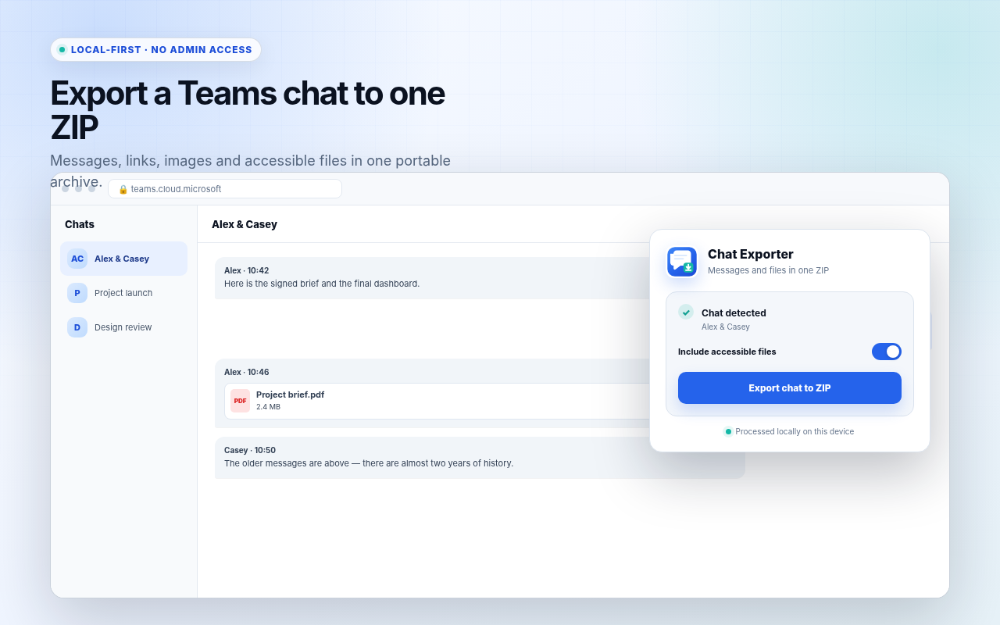

# Chat Exporter for Microsoft Teams — Files & ZIP

A local-first Chromium extension that exports the currently open Microsoft Teams conversation, its accessible files, and diagnostic reports to one portable ZIP archive.

> Pack the conversation, the links, and the files you can access — without sending chat content to the developer.



## Highlights

- Export a personal or group chat from `teams.cloud.microsoft` or `teams.microsoft.com`.
- Load older messages from the virtualized Teams history before creating the archive.
- Preserve authors, timestamps, message IDs, text, sanitized rich HTML, links, reactions, and attachment references.
- Download images and files available to the signed-in Microsoft 365 account.
- Receive HTML, JSON, CSV, link data, attachment diagnostics, and files in one ZIP.
- Process the conversation locally in the browser with no backend, account, analytics, or telemetry.
- Start only after an explicit click; no persistent content script and no broad host permission.
- Cancel safely. A capture-limit failure does not create a silently partial archive.

## Archive contents

```text
chat.html
chat.json
chat.csv
links.csv
attachments-report.csv
failed-attachments.html
README.txt
attachments/
```

`chat.html` is a searchable offline transcript. `chat.json` uses the stable `chat-exporter-for-teams/v1` schema. `chat.csv` provides one message per row. Every discovered file receives one `downloaded`, `failed`, or `skipped` row in `attachments-report.csv`.

## Install locally

1. Download or clone this repository.
2. Run `npm run build`.
3. Open `chrome://extensions` in Chrome or Edge.
4. Enable **Developer mode**.
5. Select **Load unpacked** and choose the generated `dist/` directory.
6. Pin **Chat Exporter** to the toolbar.

The extension supports Chrome 109 or newer and is expected to run in current Chromium-based Microsoft Edge builds.

## Use

1. Open Microsoft Teams on the web and select a personal or group conversation.
2. Open the extension popup.
3. Review the one-time local-processing disclosure.
4. Choose whether to include accessible files.
5. Click **Export chat to ZIP**.
6. Keep the Teams tab open while the in-page panel loads history and files.
7. Save the generated ZIP.

Teams virtualizes long conversations. The exporter records messages on each scroll cycle instead of relying only on the final visible DOM.

## Privacy model

The extension requests exactly:

- `activeTab` — temporary access after the user opens the extension;
- `scripting` — inject the local exporter into the active Teams tab after an explicit action;
- `storage` — remember non-sensitive preferences and the disclosure acknowledgement.

It requests no static host permissions and no persistent content script. It does not use a developer-controlled server, telemetry, analytics, advertising, remote executable code, `eval`, or dynamically loaded JavaScript.

The signed-in browser still communicates with Microsoft Teams, OneDrive, SharePoint, and other Microsoft 365 services needed to display the conversation or retrieve a selected file. The extension does not bypass authorization, Conditional Access, retention, CORS, tenant policy, or file deletion.

Read the full [privacy policy](docs/privacy-policy.md).

## Known limits

- Version 0.1.0 targets the currently open personal or group chat, not channel posts, channel threads, or tenant-wide export.
- Meeting chats may work when their rendered DOM matches the supported chat structure, but are not yet promised in the store listing.
- Some OneDrive or SharePoint files cannot be fetched automatically because of permission, expired URLs, CORS, sign-in flows, Conditional Access, or deletion. Their original URLs and failure reasons remain in the reports.
- Classic ZIP limits apply: no ZIP64 and no archive above 4 GiB.
- Microsoft can change the Teams DOM without notice. Fixtures cover known structures, and selector updates may be needed.

## Architecture

```text
manifest.json                 Manifest V3 metadata and minimal permissions
src/background.js             Active-tab inspection and explicit page-world injection
src/popup/                    Disclosure, detection, preferences, and one primary action
src/content/teams-adapter.js  Teams DOM selectors and message extraction
src/content/capture.js        Virtualized-history traversal and completeness checks
src/content/attachments.js    Authenticated fetches, limits, and status reporting
src/content/renderers.js      Safe HTML, JSON, CSV, links, and diagnostic reports
src/content/archive.js        Archive assembly
src/content/zip.js            Dependency-free ZIP writer
src/content/overlay.js        Trusted Types-safe progress UI and cancellation
scripts/                      Build, validation, assets, site, and Web Store release tools
tests/                        Unit and real-Chromium fixture tests
store-assets/                 Chrome Web Store icon, screenshots, and promotional tiles
site/                         SEO-oriented GitHub Pages source
```

The source remains split into ES modules. `scripts/build.mjs` creates a self-contained page-world bundle because attachment requests must use the current signed-in page context. The generated runtime contains no remote code.

## Development

Required: Node.js 22 or newer. The project has no runtime or development npm dependencies.

```bash
npm ci
npm test
```

Useful commands:

```bash
npm run check
npm run test:unit
npm run test:browser
npm run generate:assets
npm run build
npm run build:zip
npm run validate:package
npm run build:site
```

The browser suite forces `require-trusted-types-for 'script'` and confirms that the progress overlay works without assigning strings to `innerHTML`, `outerHTML`, or related HTML sinks.

## Releases

The release package is deterministic and validated against an explicit allowlist. GitHub Actions provides:

- CI for pushes and pull requests;
- GitHub Pages deployment for the product, privacy, support, and guides;
- Chrome Web Store API V2 upload and optional submission;
- `UPLOAD_ONLY` as the safe default;
- GitHub Release creation only after a verified Web Store upload.

The first Chrome Web Store item must be created manually to obtain an extension ID. See [pipeline setup](docs/chrome-web-store-pipeline.md) and the [release checklist](docs/release-checklist.md).

## Store materials

- [Chrome Web Store listing copy](docs/chrome-web-store-listing.md)
- [Privacy policy](docs/privacy-policy.md)
- [Support guide](docs/support.md)
- [Store screenshots and promotional assets](store-assets/)

## Support and security

Use the [support guide](docs/support.md) for troubleshooting. Security issues involving exposure of conversation data should be reported privately to `646826@gmail.com` rather than posted with sensitive chat content in a public issue.

## Trademark notice

Microsoft and Microsoft Teams are trademarks of the Microsoft group of companies. This independent extension is not affiliated with, endorsed by, or sponsored by Microsoft.

## License

MIT. See [LICENSE](LICENSE).
